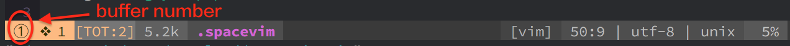

| Key Binding     | Mode     | Description                                            |
| --------------- | -------- | ------------------------------------------------------ |
| `SPC b 1`       | Normal   | switch to **b**uffer with number **1**                 |
| `SPC b 2`       | Normal   | switch to **b**uffer with number **2**                 |
| `SPC b 3`       | Normal   | switch to **b**uffer with number **3**                 |
| `SPC b 4`       | Normal   | switch to **b**uffer with number **4**                 |
| `SPC b 5`       | Normal   | switch to **b**uffer with number **5**                 |
| `SPC b 6`       | Normal   | switch to **b**uffer with number **6**                 |
| `SPC b 7`       | Normal   | switch to **b**uffer with number **7**                 |
| `SPC b 8`       | Normal   | switch to **b**uffer with number **8**                 |
| `SPC b 9`       | Normal   | switch to **b**uffer with number **9**                 |
| `SPC b p`       | Normal   | switch to **p**revious **b**uffer                      |
| `SPC b n`       | Normal   | switch to **n**ext **b**uffer                          |
| `<Tab>`         | Normal   | swtich to next buffer, equal to `SPC b n`              |
| `<Shift-Tab>`   | Normal   | switch to previous buffer, equal to `SPC b p`          |
| `SPC b d`       | Normal   | **d**elete current **b**uffer                          |
| `SPC b k`       | Normal   | **k**ill current **b**uffer                            |



Check the details of a certain key binding, e.g., `:verbose nmap <Leader>bp`:

```
:verbose nmap <Leader>bp
n  <Space>bp   * :bprevious<CR>
        Last set from ~/.vim/plugged/vim-better-default/plugin/default.vim
```

Show all buffers via `:files`, `:buffers` or `:ls`, see `:h :buffers`.
