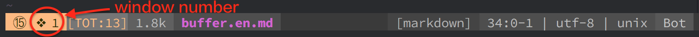

| Key Binding   | Mode     | Description                                     |
| ------------- | -------- | -------------------------------------------     |
| `SPC b [1-9]` | Normal   | move cursor to the window with number [1-9]     |
| `SPC w j`     | Normal   | move cursor to the window below current one     |
| `SPC w k`     | Normal   | move cursor to the window above current one     |
| `SPC w h`     | Normal   | move cursor to the window left of current one   |
| `SPC w l`     | Normal   | move cursor to the windows right of current one |
| `SPC w J`     | Normal   | Increase current window height downwards        |
| `SPC w K`     | Normal   | Increase current window height upwards          |
| `SPC w H`     | Normal   | Increase current window height rightwards       |
| `SPC w L`     | Normal   | Increase current window height leftwards        |
| `SPC w v`     | Normal   | split window **v**ertically                     |
| `SPC w 2`     | Normal   | 2 columns, equal to `SPC w v`                   |
| `SPC w s`     | Normal   | **s**plit window horizontally                   |
| `SPC w -`     | Normal   | equal to `SPC w -`                              |
| `SPC w d`     | Normal   | **d**elete the current window                   |
| `SPC w q`     | Normal   | **q**uit the current window                     |
| `SPC w w`     | Normal   | choose **w**indow                               |
| `SPC w r`     | Normal   | **r**otate windows downwards/rightwards         |
| `SPC w m`     | Normal   | **m**aximize the window in GVim                 |

