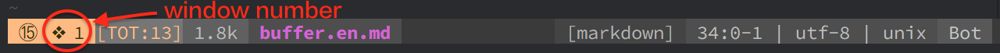

| Key Binding   | Mode     | Description                                               |
| ------------- | -------- | --------------------------------------------------------- |
| `SPC w j`     | Normal   | 移动至下方窗口                                            |
| `SPC w k`     | Normal   | 移动至上方窗口                                            |
| `SPC w h`     | Normal   | 移动至左侧窗口                                            |
| `SPC w l`     | Normal   | 移动至右侧窗口                                            |
| `SPC w J`     | Normal   | 向下扩大当前窗口                                          |
| `SPC w K`     | Normal   | 向上扩大当前窗口                                          |
| `SPC w H`     | Normal   | 向右扩大当前窗口                                          |
| `SPC w L`     | Normal   | 向左扩大当前窗口                                          |
| `SPC w v`     | Normal   | 竖直分割窗口                                              |
| `SPC w 2`     | Normal   | 将窗口分割为两列，等同于 `SPC w v`                        |
| `SPC w s`     | Normal   | 水平分割窗口， 等同于 `SPC w -`                           |
| `SPC w d`     | Normal   | 关闭 (**d**elete) 当前窗口                                |
| `SPC w q`     | Normal   | 退出 (**q**uit) 当前窗口，若是最后一个窗口则退出 Vim      |
| `SPC w w`     | Normal   | 在所有窗口中循环移动                                      |
| `SPC w r`     | Normal   | 向右或向下方交换 (**r**eplace) 窗口                       |
| `SPC w m`     | Normal   | GUI 环境下 vim 窗口最大化 (**m**aximize) 开关             |

